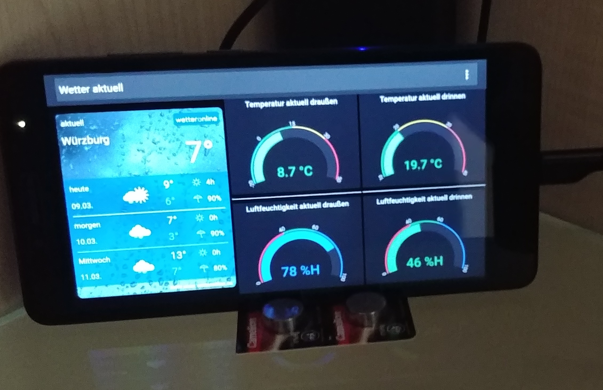

# WeatherFrontend

This is a wrapper to display weather data summary on an Android .

## Frontend content
* Public weather forecast for Wuerzburg/Germany from WetterOnline
* Private weather data (indoor and outdoor) from local Grafana board

## Result view

